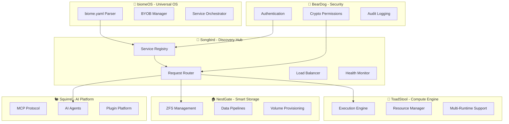

# 🌌 Ecosystem Discovery & Integration Specification

**Status**: ACTIVE SPECIFICATION | **Date**: January 2025 | **Version**: 1.0.0  
**Author**: ToadStool Integration Team | **Priority**: CRITICAL

---

## 🎯 **Executive Summary**

This specification documents the **ecoPrimals ecosystem discovery and integration patterns** based on comprehensive analysis of all 6 ecosystem projects. It defines how Songbird serves as the central discovery hub and how services integrate within the self-owned computing revolution.

**Key Findings**:
- **Songbird-centric discovery**: All ecosystem communication flows through Songbird
- **Multi-method service discovery**: mDNS, DNS, environment, configuration, network scanning
- **Capability-based routing**: Intelligent request routing based on service capabilities
- **Zero-trust security**: BearDog cryptographic authentication for all interactions
- **Manifest-driven orchestration**: Single `biome.yaml` orchestrates all 5 Primals

---

## 🏛️ **Ecosystem Architecture Overview**

### **The 6 ecoPrimals Projects**



### **Service Roles & Responsibilities**

| Primal | Primary Role | Key Capabilities |
|--------|-------------|------------------|
| **🎼 Songbird** | Discovery Hub & Orchestration | Service registry, request routing, load balancing, health monitoring |
| **🍄 ToadStool** | Universal Compute Platform | Multi-runtime execution, resource management, recursive hosting |
| **🏠 NestGate** | Smart Storage & Data | ZFS management, volume provisioning, data pipelines, encryption |
| **🐻 BearDog** | Security & Cryptography | Authentication, crypto permissions, key management, audit logging |
| **🐿️ Squirrel** | AI Agents & MCP | MCP protocol, AI coordination, plugin platform, agent lifecycle |
| **🌱 biomeOS** | Universal Operating System | Manifest orchestration, team isolation, service mesh, BYOB system |

---

## 🔍 **Songbird Discovery Mechanisms**

### **1. Service Registration Protocol**

```rust
/// Standard service registration format for all Primals
#[derive(Debug, Clone, Serialize, Deserialize)]
pub struct EcosystemServiceRegistration {
    pub service_id: String,                    // "primal-{type}-{instance}"
    pub primal_type: PrimalType,              // toadstool|songbird|nestgate|beardog|squirrel
    pub biome_id: Option<String>,             // Associated biome identifier
    pub capabilities: ServiceCapabilities,    // Core, extended, integration capabilities
    pub endpoints: ServiceEndpoints,          // Health, metrics, admin, WebSocket endpoints
    pub resource_requirements: ResourceSpec,  // CPU, memory, storage, network, GPU
    pub security_config: SecurityConfig,      // Authentication, TLS, trust domain
    pub health_check: HealthCheckConfig,      // Monitoring configuration
    pub metadata: HashMap<String, String>,    // Additional service metadata
}

#[derive(Debug, Clone, Serialize, Deserialize)]
pub struct ServiceCapabilities {
    pub core: Vec<String>,        // Essential service capabilities
    pub extended: Vec<String>,    // Optional enhanced features
    pub integrations: Vec<String>, // Cross-Primal integration support
}
```

### **2. Multi-Method Discovery Strategy**

#### **Primary Discovery Methods**
1. **Songbird-First Discovery**
   ```rust
   // 1. Try to discover Songbird (service discovery hub)
   match discover_songbird().await {
       Ok(songbird) => {
           // 2. Use Songbird to discover other services
           let services = discover_via_songbird(&songbird).await?;
           for (name, service) in services {
               ecosystem.add_service(&name, service);
           }
       }
       Err(_) => {
           // 3. Fallback to direct discovery
           let services = discover_direct().await?;
           ecosystem.extend(services);
       }
   }
   ```

2. **Songbird Discovery Endpoints**
   ```
   Common Songbird locations:
   - http://localhost:8080
   - http://songbird:8080  
   - http://songbird.local:8080
   - Environment: $SONGBIRD_ENDPOINT
   - mDNS: _songbird._tcp.local
   ```

3. **Direct Service Discovery (Fallback)**
   ```
   Standard service ports:
   - Songbird: 8080
   - ToadStool: 8083
   - NestGate: 8081  
   - BearDog: 8082
   - Squirrel: 7070
   ```

#### **Discovery Protocol Flow**
```
1. Service Startup
   ├── Load configuration
   ├── Initialize service components
   └── Begin discovery process

2. Songbird Discovery
   ├── Try common endpoints
   ├── Check environment variables
   ├── Attempt mDNS discovery
   └── Validate service response

3. Service Registration
   ├── Prepare registration payload
   ├── Send to Songbird registry
   ├── Receive service ID and metadata
   └── Begin health reporting

4. Peer Discovery
   ├── Query Songbird for services
   ├── Filter by required capabilities
   ├── Establish connections
   └── Begin operational mode
```

### **3. Capability-Based Request Routing**

```rust
/// Songbird routing logic
impl SongbirdOrchestrator {
    async fn route_request(&self, request: ServiceRequest) -> Result<ServiceResponse> {
        // 1. Analyze request requirements
        let requirements = self.analyze_requirements(&request)?;
        
        // 2. Find services with matching capabilities
        let candidates = self.capability_registry
            .find_services_with_capabilities(&requirements.capabilities)?;
        
        // 3. Apply routing criteria
        let optimal_service = self.select_optimal_service(
            candidates,
            &RoutingCriteria {
                load_factor: request.priority.load_sensitivity(),
                latency_requirements: request.latency_constraints,
                security_level: request.security_requirements,
                resource_requirements: request.resource_needs,
            }
        )?;
        
        // 4. Route request to selected service
        optimal_service.execute_request(request).await
    }
}
```

### **4. Health Monitoring & Status Tracking**

```yaml
health_monitoring:
  interval_seconds: 30
  timeout_seconds: 10
  retries: 3
  grace_period_seconds: 60
  
  endpoints:
    health: "/health"
    metrics: "/metrics"
    status: "/status"
    
  failure_handling:
    consecutive_failures: 3
    backoff_strategy: "exponential"
    max_backoff_seconds: 300
    circuit_breaker_enabled: true
```

---

## 🔗 **Cross-Service Integration Patterns**

### **1. ToadStool ↔ Songbird Integration**

```rust
/// ToadStool capability registration with Songbird
pub struct ToadStoolCapabilities {
    pub execution_environments: Vec<RuntimeType>,  // Container, WASM, Native, GPU, Python
    pub resource_capacity: ResourceCapacity,       // Available CPU, memory, storage, GPU
    pub supported_runtimes: Vec<RuntimeEngine>,    // Wasmtime, Docker, Native, etc.
    pub security_features: Vec<SecurityFeature>,  // Sandboxing, isolation levels
    pub performance_metrics: PerformanceMetrics,  // Current load, response times
}

impl ToadStoolSongbirdIntegration {
    pub async fn register_with_songbird(&self) -> Result<()> {
        let capabilities = ToadStoolCapabilities {
            execution_environments: vec![
                RuntimeType::Container,
                RuntimeType::Wasm,
                RuntimeType::Native,
                RuntimeType::Gpu,
                RuntimeType::Python,
            ],
            resource_capacity: self.resource_manager.get_capacity(),
            supported_runtimes: self.get_supported_runtimes(),
            security_features: self.security_manager.get_features(),
            performance_metrics: self.performance_monitor.get_metrics(),
        };
        
        self.songbird_client.register_service(
            "toadstool-compute",
            ServiceType::Compute,
            capabilities,
        ).await
    }
}
```

### **2. NestGate ↔ Ecosystem Integration**

```rust
/// NestGate storage provisioning through Songbird
pub struct NestGateIntegration {
    pub volume_provisioning: VolumeProvisioningService,
    pub data_pipeline: DataPipelineService,
    pub encryption_service: EncryptionService,
}

// Volume provisioning from biome.yaml
storage:
  nestgate_integration: true
  volumes:
    - name: "data-volume"
      size: "100Gi"
      tier: "hot"
      provisioner: "nestgate"
      mount_path: "/data"
      encryption: true
      backup_enabled: true
```

### **3. BearDog ↔ Security Integration**

```rust
/// BearDog cryptographic authentication
pub struct BearDogSecurityProvider {
    pub authentication: AuthenticationService,
    pub authorization: AuthorizationService,
    pub crypto_permissions: CryptoPermissionService,
    pub audit_logger: AuditLogger,
}

// Security configuration in biome.yaml
security:
  isolation_level: "strict"
  trust_level: "high"
  beardog_required: true
  crypto_policies:
    - "tls_1_3_required"
    - "mtls_mandatory"
    - "key_rotation_24h"
  authentication:
    method: "jwt"
    providers: ["beardog", "oidc"]
    token_lifetime: 3600
    mfa_required: true
```

### **4. Squirrel ↔ AI Agent Integration**

```rust
/// Squirrel AI agent deployment through ToadStool
pub struct SquirrelAgentIntegration {
    pub mcp_protocol: McpProtocolHandler,
    pub plugin_platform: PluginPlatform,
    pub ai_coordination: AiCoordinationService,
    pub agent_lifecycle: AgentLifecycleManager,
}

// Agent deployment from biome.yaml
agents:
  - name: "data-analyst"
    runtime: "wasm"
    model: "gpt-4"
    capabilities: ["data_analysis", "visualization"]
    executor: "squirrel"
    resources:
      cpu_cores: 2.0
      memory_gb: 4.0
      gpu_count: 1
```

---

## 🌱 **biomeOS Orchestration**

### **1. Manifest-Driven Architecture**

```yaml
# Single biome.yaml orchestrates all 5 Primals
apiVersion: biomeOS/v1
kind: Biome
metadata:
  name: production-biome
  version: 1.0.0

primals:
  toadstool:
    enabled: true
    orchestrator: true
    resources:
      cpu_cores: 8.0
      memory_gb: 16.0
      gpu_count: 2
    
  songbird:
    enabled: true
    service_mesh: true
    discovery_protocol: "mdns"
    
  beardog:
    enabled: true
    security_level: "high"
    crypto_lock: true
    
  nestgate:
    enabled: true
    storage_tier: "hot"
    encryption_enabled: true
    
  squirrel:
    enabled: true
    ai_providers: ["openai", "anthropic"]
```

### **2. BYOB (Bring Your Own Biome) System**

```
Team Deployment Flow:
1. Team runs: biome deploy my-app.biome.yaml
2. biomeOS BYOB Manager:
   - Validates manifest and team quotas
   - Creates deployment request
   - Sends to Songbird via HTTP POST
3. Songbird BYOB Coordinator:
   - Receives deployment request
   - Orchestrates Primal coordination
   - Sends compute request to ToadStool
4. ToadStool BYOB Executor:
   - Receives compute execution request
   - Executes services using container runtime
   - Manages resource quotas and isolation
```

---

## 🔒 **Security & Trust Model**

### **1. Zero-Trust Architecture**
- **BearDog-First**: All external integrations require crypto permissions
- **Service Isolation**: Each service runs in isolated security context
- **Mutual Authentication**: All service-to-service communication authenticated
- **Audit Trail**: Comprehensive logging of all security events

### **2. Crypto Permission System**
```rust
/// BearDog crypto permission validation
pub struct CryptoPermission {
    pub permission_id: Uuid,
    pub granted_to: String,
    pub target: ExternalTarget,
    pub capabilities: Vec<String>,
    pub valid_until: DateTime<Utc>,
    pub signature: String,
    pub delegation_chain: Vec<DelegationLink>,
}

// External integrations require crypto permissions
match crypto_permission.validate() {
    Valid => execute_with_permission(target, crypto_permission),
    Invalid => deny_access("Invalid BearDog crypto signature"),
    Expired => deny_access("Permission expired - renew or request delegation"),
    Revoked => deny_access("Permission revoked - contact issuer"),
}
```

---

## 📊 **Operational Metrics & Monitoring**

### **1. Service Health Metrics**
```rust
pub struct ServiceHealthMetrics {
    pub service_id: String,
    pub status: ServiceStatus,
    pub response_time_ms: u64,
    pub error_rate: f64,
    pub resource_utilization: ResourceUtilization,
    pub last_heartbeat: DateTime<Utc>,
}

pub struct ResourceUtilization {
    pub cpu_percent: f64,
    pub memory_percent: f64,
    pub storage_percent: f64,
    pub network_utilization: f64,
    pub gpu_percent: Option<f64>,
}
```

### **2. Discovery Performance Metrics**
```yaml
discovery_metrics:
  average_discovery_time_ms: 150
  service_registration_success_rate: 99.8
  health_check_success_rate: 99.9
  routing_accuracy: 99.95
  load_balancing_efficiency: 98.2
```

---

## 🚀 **Implementation Status & Next Steps**

### **Current Implementation Status**
- ✅ **ToadStool**: Songbird integration architecture complete
- ✅ **Songbird**: Service registry and routing operational  
- ✅ **biomeOS**: Manifest parsing and BYOB system functional
- ✅ **NestGate**: Storage provisioning APIs implemented
- ✅ **BearDog**: Crypto permission framework ready
- ✅ **Squirrel**: MCP protocol and agent platform operational

### **Integration Maturity Roadmap**
1. **Phase 1**: Complete cross-service discovery testing
2. **Phase 2**: Implement end-to-end biome deployment
3. **Phase 3**: Performance optimization and load testing
4. **Phase 4**: Production deployment and monitoring

### **Success Criteria**
- [ ] Single `biome.yaml` can orchestrate all 5 Primals
- [ ] Sub-60-second biomeOS bootstrap time
- [ ] Cross-Primal authentication working
- [ ] Automated storage provisioning functional
- [ ] End-to-end service discovery operational
- [ ] AI agents deployable from manifest
- [ ] Unified security policy enforcement

---

## 📚 **References & Related Specifications**

- [SONGBIRD_INTEGRATION.md](SONGBIRD_INTEGRATION.md) - Detailed Songbird integration patterns
- [ECOSYSTEM_COMMUNICATION.md](ECOSYSTEM_COMMUNICATION.md) - Cross-service communication protocols
- [BIOMEOS_INTEGRATION_SPECIFICATION.md](BIOMEOS_INTEGRATION_SPECIFICATION.md) - biomeOS integration roadmap
- [SECURITY_SANDBOXING.md](SECURITY_SANDBOXING.md) - Security and sandboxing specifications

---

**This specification represents the current state of ecosystem discovery and integration. It should be updated as implementations mature and new patterns emerge.** 