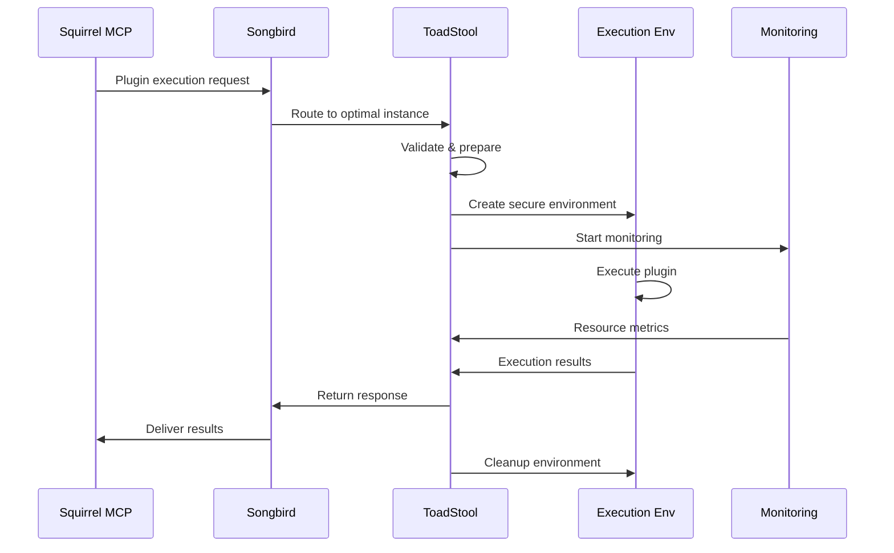

# 🚀 Plugin Execution Specification

## Executive Summary

ToadStool provides **comprehensive plugin execution** with end-to-end lifecycle management, security isolation, resource monitoring, and seamless integration with the ecosystem through standardized execution workflows.

---

## 🎯 **Execution Architecture**

### **Plugin Execution Pipeline**


### **Core Execution Interface**
```rust
#[async_trait::async_trait]
pub trait PluginExecutor: Send + Sync + Debug {
    /// Execute plugin with full lifecycle management
    async fn execute_plugin(&self, request: PluginExecutionRequest) -> Result<PluginExecutionResponse>;
    
    /// Get executor capabilities and supported plugin types
    fn get_executor_capabilities(&self) -> ExecutorCapabilities;
    
    /// Validate plugin before execution
    async fn validate_plugin(&self, plugin_spec: &PluginSpec) -> Result<ValidationResult>;
    
    /// Get execution status for running plugins
    async fn get_execution_status(&self, execution_id: Uuid) -> Result<ExecutionStatus>;
    
    /// Cancel running plugin execution
    async fn cancel_execution(&self, execution_id: Uuid) -> Result<CancellationResult>;
}
```

---

## 📋 **Plugin Execution Request**

### **Comprehensive Request Structure**
```rust
#[derive(Debug, Clone, Serialize, Deserialize)]
pub struct PluginExecutionRequest {
    /// Request metadata
    pub request_id: Uuid,
    pub source_service: String,
    pub priority: ExecutionPriority,
    pub timeout: Option<Duration>,
    
    /// Plugin specification
    pub plugin_spec: PluginSpec,
    pub runtime_hint: Option<RuntimeType>,
    
    /// Execution context
    pub execution_context: ExecutionContext,
    pub mcp_context: Option<McpContext>,
    
    /// Resource requirements
    pub resource_requirements: ResourceRequirements,
    pub resource_sharing_policy: ResourceSharingPolicy,
    
    /// Security configuration
    pub security_policy: SecurityPolicy,
    pub capability_grants: Vec<Capability>,
    
    /// Input data and configuration
    pub input_data: PluginInputData,
    pub configuration: PluginConfiguration,
    pub environment_variables: HashMap<String, String>,
    
    /// Monitoring and observability
    pub monitoring_config: MonitoringConfig,
    pub trace_context: Option<TraceContext>,
    
    /// Callback and notification settings
    pub callback_config: Option<CallbackConfig>,
    pub notification_settings: NotificationSettings,
}

#[derive(Debug, Clone, Serialize, Deserialize)]
pub struct PluginSpec {
    /// Plugin identification
    pub plugin_id: String,
    pub version: String,
    pub source: PluginSource,
    
    /// Plugin metadata
    pub metadata: PluginMetadata,
    pub dependencies: Vec<PluginDependency>,
    pub requirements: PluginRequirements,
    
    /// Execution configuration
    pub execution_config: PluginExecutionConfig,
    pub runtime_preferences: RuntimePreferences,
}

#[derive(Debug, Clone, Serialize, Deserialize)]
pub enum PluginSource {
    /// Container image
    ContainerImage {
        image: String,
        tag: Option<String>,
        registry: Option<String>,
        auth: Option<RegistryAuth>,
    },
    
    /// WebAssembly module
    WasmModule {
        module_path: String,
        module_hash: Option<String>,
        imports: Vec<WasmImport>,
    },
    
    /// Native executable
    NativeExecutable {
        executable_path: String,
        executable_hash: Option<String>,
        architecture: Architecture,
        platform: Platform,
    },
    
    /// Source code to compile/interpret
    SourceCode {
        language: ProgrammingLanguage,
        source_files: Vec<SourceFile>,
        build_config: Option<BuildConfiguration>,
    },
    
    /// Remote plugin reference
    Remote {
        url: String,
        auth: Option<RemoteAuth>,
        cache_policy: CachePolicy,
    },
}
```

---

## ⚙️ **Execution Lifecycle Management**

### **Plugin Execution Engine**
```rust
#[derive(Debug)]
pub struct PluginExecutionEngine {
    runtime_manager: Arc<RuntimeManager>,
    security_manager: Arc<SecurityManager>,
    resource_manager: Arc<ResourceManager>,
    monitoring_system: Arc<MonitoringSystem>,
    execution_registry: Arc<RwLock<ExecutionRegistry>>,
}

impl PluginExecutionEngine {
    /// Execute plugin with full lifecycle management
    pub async fn execute_plugin(
        &self,
        request: PluginExecutionRequest
    ) -> Result<PluginExecutionResponse> {
        let execution_id = Uuid::new_v4();
        
        // Phase 1: Validation and Preparation
        let validation_result = self.validate_execution_request(&request).await?;
        let runtime = self.select_optimal_runtime(&request, &validation_result).await?;
        
        // Phase 2: Resource Allocation
        let resource_allocation = self.resource_manager
            .allocate_resources(execution_id, request.resource_requirements.clone())
            .await?;
        
        // Phase 3: Security Context Setup
        let security_context = self.security_manager
            .create_security_context(execution_id, request.security_policy.clone())
            .await?;
        
        // Phase 4: Execution Environment Creation
        let execution_environment = self.create_execution_environment(
            execution_id,
            &request,
            &resource_allocation,
            &security_context,
            &runtime
        ).await?;
        
        // Phase 5: Monitoring Setup
        let monitoring_session = self.monitoring_system
            .start_monitoring(execution_id, &request.monitoring_config)
            .await?;
        
        // Phase 6: Plugin Execution
        let execution_result = self.execute_in_environment(
            execution_id,
            &request,
            execution_environment,
            monitoring_session
        ).await;
        
        // Phase 7: Cleanup and Response
        self.cleanup_execution(execution_id, resource_allocation, security_context).await?;
        
        match execution_result {
            Ok(result) => Ok(self.create_success_response(execution_id, result)),
            Err(error) => Ok(self.create_error_response(execution_id, error)),
        }
    }
}
```

### **Execution State Management**
```rust
#[derive(Debug, Clone, Serialize, Deserialize)]
pub enum ExecutionState {
    /// Request received and queued
    Queued {
        queue_position: u32,
        estimated_start_time: Option<chrono::DateTime<chrono::Utc>>,
    },
    
    /// Preparing execution environment
    Preparing {
        preparation_stage: PreparationStage,
        progress_percent: f64,
    },
    
    /// Plugin is actively running
    Running {
        started_at: chrono::DateTime<chrono::Utc>,
        current_stage: Option<String>,
        progress_info: Option<ProgressInfo>,
    },
    
    /// Execution completed successfully
    Completed {
        completed_at: chrono::DateTime<chrono::Utc>,
        execution_duration: Duration,
        output_summary: Option<String>,
    },
    
    /// Execution failed
    Failed {
        failed_at: chrono::DateTime<chrono::Utc>,
        error: ExecutionError,
        recovery_possible: bool,
    },
    
    /// Execution was cancelled
    Cancelled {
        cancelled_at: chrono::DateTime<chrono::Utc>,
        cancellation_reason: String,
        cleanup_status: CleanupStatus,
    },
    
    /// Execution timed out
    TimedOut {
        timeout_at: chrono::DateTime<chrono::Utc>,
        timeout_duration: Duration,
        partial_results: Option<PartialResults>,
    },
}

#[derive(Debug)]
pub struct ExecutionRegistry {
    active_executions: HashMap<Uuid, ExecutionRecord>,
    execution_history: VecDeque<ExecutionRecord>,
    execution_metrics: ExecutionMetrics,
}

impl ExecutionRegistry {
    /// Register new execution
    pub fn register_execution(&mut self, execution_id: Uuid, request: &PluginExecutionRequest) {
        let record = ExecutionRecord {
            execution_id,
            request: request.clone(),
            state: ExecutionState::Queued {
                queue_position: self.get_queue_position(),
                estimated_start_time: self.estimate_start_time(),
            },
            created_at: chrono::Utc::now(),
            last_updated: chrono::Utc::now(),
        };
        
        self.active_executions.insert(execution_id, record);
    }
    
    /// Update execution state
    pub fn update_execution_state(&mut self, execution_id: Uuid, state: ExecutionState) {
        if let Some(record) = self.active_executions.get_mut(&execution_id) {
            record.state = state;
            record.last_updated = chrono::Utc::now();
        }
    }
}
```

---

## 🔒 **Security and Isolation**

### **Plugin Security Validation**
```rust
#[derive(Debug)]
pub struct PluginSecurityValidator {
    signature_verifier: Box<dyn SignatureVerifier>,
    vulnerability_scanner: Box<dyn VulnerabilityScanner>,
    policy_engine: Box<dyn SecurityPolicyEngine>,
    reputation_service: Box<dyn ReputationService>,
}

impl PluginSecurityValidator {
    /// Comprehensive security validation of plugin
    pub async fn validate_plugin_security(
        &self,
        plugin_spec: &PluginSpec,
        security_policy: &SecurityPolicy
    ) -> Result<SecurityValidationResult> {
        let mut validation_result = SecurityValidationResult::new();
        
        // Verify plugin signature/authenticity
        let signature_result = self.signature_verifier
            .verify_plugin_signature(plugin_spec)
            .await?;
        validation_result.add_check("signature_verification", signature_result);
        
        // Scan for known vulnerabilities
        let vulnerability_result = self.vulnerability_scanner
            .scan_plugin(plugin_spec)
            .await?;
        validation_result.add_check("vulnerability_scan", vulnerability_result);
        
        // Check against security policy
        let policy_result = self.policy_engine
            .evaluate_plugin(plugin_spec, security_policy)
            .await?;
        validation_result.add_check("policy_compliance", policy_result);
        
        // Check plugin reputation
        let reputation_result = self.reputation_service
            .check_plugin_reputation(plugin_spec)
            .await?;
        validation_result.add_check("reputation_check", reputation_result);
        
        Ok(validation_result)
    }
}
```

### **Runtime Isolation Enforcement**
```rust
#[derive(Debug)]
pub struct IsolationEnforcer {
    sandbox_manager: Box<dyn SandboxManager>,
    capability_enforcer: Box<dyn CapabilityEnforcer>,
    resource_limiter: Box<dyn ResourceLimiter>,
    network_isolator: Box<dyn NetworkIsolator>,
}

impl IsolationEnforcer {
    /// Enforce complete isolation for plugin execution
    pub async fn enforce_isolation(
        &self,
        execution_id: Uuid,
        security_context: &SecurityContext,
        resource_allocation: &ResourceAllocation
    ) -> Result<IsolationContext> {
        // Create sandbox environment
        let sandbox = self.sandbox_manager
            .create_sandbox(execution_id, &security_context.isolation_level)
            .await?;
        
        // Enforce capability restrictions
        let capability_context = self.capability_enforcer
            .enforce_capabilities(execution_id, &security_context.capabilities)
            .await?;
        
        // Apply resource limits
        let resource_limits = self.resource_limiter
            .apply_limits(execution_id, &resource_allocation.limits)
            .await?;
        
        // Configure network isolation
        let network_isolation = self.network_isolator
            .configure_isolation(execution_id, &security_context.network_policy)
            .await?;
        
        Ok(IsolationContext {
            execution_id,
            sandbox,
            capability_context,
            resource_limits,
            network_isolation,
        })
    }
}
```

---

## 📊 **Monitoring and Observability**

### **Comprehensive Execution Monitoring**
```rust
#[derive(Debug)]
pub struct ExecutionMonitor {
    metrics_collector: Box<dyn MetricsCollector>,
    log_aggregator: Box<dyn LogAggregator>,
    trace_collector: Box<dyn TraceCollector>,
    alert_manager: Box<dyn AlertManager>,
}

#[derive(Debug, Clone, Serialize, Deserialize)]
pub struct ExecutionMetrics {
    /// Basic execution metrics
    pub execution_time: Duration,
    pub startup_time: Duration,
    pub completion_time: chrono::DateTime<chrono::Utc>,
    
    /// Resource utilization
    pub resource_usage: ResourceUsageMetrics,
    pub peak_resource_usage: ResourceUsageMetrics,
    pub resource_efficiency: f64,
    
    /// Performance metrics
    pub throughput: Option<f64>,
    pub latency_percentiles: LatencyPercentiles,
    pub error_rate: f64,
    
    /// Security metrics
    pub security_events: u32,
    pub capability_violations: u32,
    pub sandbox_breaches: u32,
    
    /// Plugin-specific metrics
    pub custom_metrics: HashMap<String, Value>,
    pub plugin_telemetry: Option<PluginTelemetry>,
}

impl ExecutionMonitor {
    /// Start comprehensive monitoring for execution
    pub async fn start_monitoring(
        &self,
        execution_id: Uuid,
        monitoring_config: &MonitoringConfig
    ) -> Result<MonitoringSession> {
        let session = MonitoringSession::new(execution_id);
        
        // Start metrics collection
        self.metrics_collector
            .start_collection(execution_id, &monitoring_config.metrics_config)
            .await?;
        
        // Start log aggregation
        self.log_aggregator
            .start_log_collection(execution_id, &monitoring_config.logging_config)
            .await?;
        
        // Start distributed tracing
        if let Some(trace_config) = &monitoring_config.tracing_config {
            self.trace_collector
                .start_tracing(execution_id, trace_config)
                .await?;
        }
        
        // Configure alerts
        self.alert_manager
            .configure_alerts(execution_id, &monitoring_config.alert_config)
            .await?;
        
        Ok(session)
    }
}
```

---

## 📤 **Response and Result Handling**

### **Comprehensive Response Structure**
```rust
#[derive(Debug, Clone, Serialize, Deserialize)]
pub struct PluginExecutionResponse {
    /// Response metadata
    pub request_id: Uuid,
    pub execution_id: Uuid,
    pub response_timestamp: chrono::DateTime<chrono::Utc>,
    
    /// Execution result
    pub result: ExecutionResult,
    pub execution_duration: Duration,
    
    /// Output data
    pub output_data: PluginOutputData,
    pub return_code: Option<i32>,
    pub stdout: Option<String>,
    pub stderr: Option<String>,
    
    /// Execution metrics and telemetry
    pub metrics: ExecutionMetrics,
    pub resource_usage: ResourceUsageReport,
    pub performance_stats: PerformanceStats,
    
    /// Security and audit information
    pub security_events: Vec<SecurityEvent>,
    pub audit_trail: AuditTrail,
    
    /// Warnings and diagnostics
    pub warnings: Vec<ExecutionWarning>,
    pub diagnostics: Vec<DiagnosticInfo>,
    
    /// Plugin-specific metadata
    pub plugin_metadata: Option<PluginExecutionMetadata>,
}

#[derive(Debug, Clone, Serialize, Deserialize)]
pub enum ExecutionResult {
    /// Successful execution
    Success {
        output: PluginOutput,
        metadata: HashMap<String, Value>,
    },
    
    /// Execution failed
    Failed {
        error: ExecutionError,
        partial_output: Option<PluginOutput>,
        recovery_suggestions: Vec<String>,
    },
    
    /// Execution timed out
    TimedOut {
        timeout_duration: Duration,
        partial_output: Option<PluginOutput>,
        continuation_possible: bool,
    },
    
    /// Execution was cancelled
    Cancelled {
        cancellation_reason: String,
        partial_output: Option<PluginOutput>,
        cleanup_status: CleanupStatus,
    },
}
```

This specification provides a comprehensive framework for plugin execution that ensures security, performance, monitoring, and reliability while maintaining flexibility and extensibility for different plugin types and execution environments. 