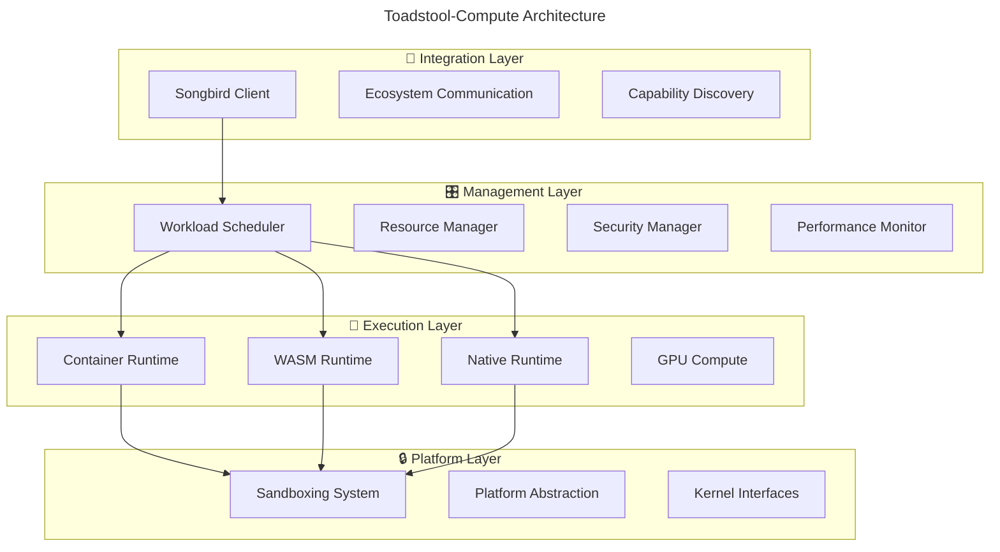
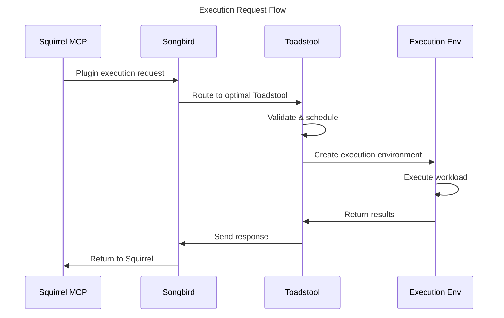

# 🍄 Toadstool-Compute Project Overview

## Executive Summary

**Toadstool-Compute** is the dedicated compute and environment management platform for the distributed ecosystem. It provides secure, cross-platform execution environments while integrating seamlessly with Songbird for discovery and NestGate for storage.

---

## 🎯 **Project Mission & Vision**

### **Mission Statement**
Provide a **universal, secure, and performant compute platform** that enables the ecosystem to execute any workload anywhere with confidence.

### **Vision**
Become the **gold standard for distributed compute platforms** - where security, performance, and developer experience converge in a Rust-native implementation.

### **Core Values**
- **Security First**: Every execution environment is secure by default
- **Performance Obsessed**: Optimize for speed without sacrificing safety
- **Developer Friendly**: Simple APIs that hide complex infrastructure
- **Ecosystem Native**: Built specifically for our distributed architecture

---

## 🏗️ **Architectural Overview**

### **Four-Layer Architecture**



### **Core Components**

#### **🔌 Integration Layer**
```yaml
songbird_integration:
  capability_registration: "Register compute capabilities with Songbird"
  request_handling: "Receive and process execution requests"
  health_reporting: "Report resource status and health"
  load_balancing: "Coordinate with multiple Toadstool instances"

ecosystem_communication:
  squirrel_plugin_execution: "Execute plugins from Squirrel MCP platform"
  nestgate_storage_access: "Coordinate storage access via Songbird"
  cross_platform_messaging: "Unified messaging across platforms"
```

#### **🎛️ Management Layer**
```yaml
workload_scheduler:
  intelligent_scheduling: "AI-powered workload placement"
  resource_optimization: "Optimal resource allocation"
  priority_management: "Handle urgent vs background tasks"
  load_distribution: "Balance load across execution environments"

resource_manager:
  dynamic_allocation: "Real-time resource allocation"
  capacity_planning: "Predictive resource planning"
  usage_monitoring: "Detailed resource usage tracking"
  limit_enforcement: "Enforce resource limits and quotas"

security_manager:
  permission_enforcement: "Fine-grained permission system"
  threat_detection: "Real-time security monitoring"
  audit_logging: "Complete security audit trail"
  vulnerability_scanning: "Proactive vulnerability management"
```

#### **🏃 Execution Layer**
```yaml
container_runtime:
  docker_integration: "Docker and containerd support"
  image_management: "Container image caching and optimization"
  network_isolation: "Container network security"
  volume_management: "Secure volume mounting"

wasm_runtime:
  wasmtime_integration: "High-performance WASM execution"
  wasi_support: "WebAssembly System Interface"
  module_caching: "WASM module optimization"
  memory_management: "Safe memory allocation"

native_runtime:
  secure_execution: "Sandboxed native code execution"
  library_management: "Dynamic library loading"
  process_isolation: "Process-level security"
  performance_optimization: "Native code optimization"

gpu_compute:
  cuda_support: "NVIDIA CUDA integration"
  opencl_support: "OpenCL compute support"
  memory_management: "GPU memory allocation"
  workload_scheduling: "GPU workload optimization"
```

#### **🔒 Platform Layer**
```yaml
sandboxing_system:
  windows_isolation: "Windows Job Objects and restricted tokens"
  macos_isolation: "App Sandbox and Seatbelt profiles"
  linux_isolation: "Namespaces, cgroups, and seccomp"
  cross_platform_api: "Unified sandboxing interface"

platform_abstraction:
  unified_interfaces: "Platform-agnostic APIs"
  capability_detection: "Runtime capability discovery"
  resource_discovery: "Hardware resource detection"
  performance_profiling: "Platform-specific optimizations"
```

---

## 🔄 **Execution Flow**

### **Request Processing Pipeline**



### **Detailed Execution Steps**

#### **1. Request Reception**
```rust
pub async fn handle_execution_request(
    &self, 
    request: ExecutionRequest
) -> Result<ExecutionResponse> {
    // 1. Validate request
    self.security_manager.validate_request(&request).await?;
    
    // 2. Check resource availability
    let resources = self.resource_manager
        .check_availability(&request.requirements).await?;
    
    // 3. Schedule execution
    let schedule = self.scheduler
        .schedule_workload(&request, &resources).await?;
    
    // 4. Execute
    self.execute_workload(schedule).await
}
```

#### **2. Environment Creation**
```rust
pub async fn create_execution_environment(
    &self,
    request: &ExecutionRequest
) -> Result<ExecutionEnvironment> {
    match request.environment_type {
        EnvironmentType::Container => {
            self.container_runtime.create_container(request).await
        }
        EnvironmentType::Wasm => {
            self.wasm_runtime.create_instance(request).await
        }
        EnvironmentType::Native => {
            self.native_runtime.create_process(request).await
        }
        EnvironmentType::Gpu => {
            self.gpu_runtime.create_compute_context(request).await
        }
    }
}
```

#### **3. Secure Execution**
```rust
pub async fn execute_in_sandbox(
    &self,
    environment: ExecutionEnvironment,
    workload: Workload
) -> Result<ExecutionResult> {
    // Create sandbox
    let sandbox = self.sandboxing_system
        .create_sandbox(&environment.security_context).await?;
    
    // Execute with monitoring
    let result = sandbox.execute_with_monitoring(workload).await?;
    
    // Cleanup
    sandbox.cleanup().await?;
    
    Ok(result)
}
```

---

## 🔌 **Ecosystem Integration**

### **Songbird Discovery Integration**

#### **Capability Registration**
```rust
pub struct ToadstoolCapabilities {
    pub execution_environments: Vec<EnvironmentType>,
    pub resource_capacity: ResourceCapacity,
    pub supported_runtimes: Vec<Runtime>,
    pub security_features: Vec<SecurityFeature>,
    pub performance_metrics: PerformanceMetrics,
}

pub async fn register_with_songbird(&self) -> Result<()> {
    let capabilities = ToadstoolCapabilities {
        execution_environments: vec![
            EnvironmentType::Container,
            EnvironmentType::Wasm,
            EnvironmentType::Native,
            EnvironmentType::Gpu,
        ],
        resource_capacity: self.resource_manager.get_capacity(),
        supported_runtimes: self.get_supported_runtimes(),
        security_features: self.security_manager.get_features(),
        performance_metrics: self.performance_monitor.get_metrics(),
    };
    
    self.songbird_client.register_service(
        "toadstool-compute",
        ServiceType::Compute,
        capabilities,
    ).await
}
```

#### **Request Routing**
```rust
// Songbird routes based on capabilities and current load
impl SongbirdOrchestrator {
    async fn route_compute_request(
        &self, 
        request: ComputeRequest
    ) -> Result<ComputeResponse> {
        // Find optimal Toadstool instance
        let toadstool = self.capability_registry
            .find_best_compute_provider(&request)?;
        
        // Route request
        toadstool.execute_request(request).await
    }
}
```

### **Cross-Project Communication**

#### **Squirrel Plugin Execution**
```yaml
squirrel_integration:
  plugin_metadata: "Squirrel provides plugin metadata and MCP context"
  execution_request: "Toadstool receives execution request via Songbird"
  result_return: "Results returned to Squirrel via Songbird"
  context_preservation: "MCP context maintained throughout execution"
```

#### **NestGate Storage Access**
```yaml
storage_integration:
  data_access: "Request storage access via Songbird routing"
  volume_mounting: "Secure volume mounting for execution environments"
  backup_coordination: "Coordinate with NestGate for data backup"
  tier_awareness: "Optimize based on storage tier information"
```

---

## 🎯 **Design Principles**

### **🔒 Security First**
```yaml
security_principles:
  zero_trust: "Never trust, always verify"
  least_privilege: "Minimal permissions by default"
  defense_in_depth: "Multiple security layers"
  audit_everything: "Complete audit trail"
  
implementation:
  sandboxing: "Every execution in isolated environment"
  permissions: "Fine-grained capability system"
  monitoring: "Real-time security event detection"
  compliance: "Security standards compliance"
```

### **⚡ Performance Obsessed**
```yaml
performance_principles:
  zero_overhead: "No unnecessary abstraction costs"
  hot_path_optimization: "Optimize critical execution paths"
  resource_efficiency: "Maximize resource utilization"
  predictable_latency: "Consistent execution times"
  
implementation:
  rust_native: "Zero-cost abstractions"
  async_runtime: "Non-blocking execution"
  memory_management: "Efficient memory allocation"
  caching: "Intelligent caching strategies"
```

### **🎯 Developer Experience**
```yaml
developer_principles:
  simple_apis: "Easy to use, hard to misuse"
  clear_documentation: "Comprehensive and up-to-date docs"
  excellent_tooling: "Rich development and debugging tools"
  fast_feedback: "Quick iteration cycles"
  
implementation:
  type_safety: "Rust type system prevents errors"
  error_handling: "Clear error messages and recovery"
  testing: "Comprehensive test coverage"
  monitoring: "Rich observability and debugging"
```

---

## 📊 **Performance Targets**

### **Execution Performance**
```yaml
latency_targets:
  wasm_startup: "< 10ms cold start"
  container_startup: "< 100ms cold start"
  native_startup: "< 5ms cold start"
  request_processing: "< 1ms request validation"

throughput_targets:
  concurrent_executions: "> 1000 simultaneous"
  requests_per_second: "> 10,000 RPS"
  resource_utilization: "> 90% efficiency"
  
scalability_targets:
  horizontal_scaling: "Linear scaling to 100+ nodes"
  vertical_scaling: "Efficient use of 128+ cores"
  memory_scaling: "Support for 1TB+ memory"
```

### **Resource Efficiency**
```yaml
efficiency_targets:
  memory_overhead: "< 5% overhead per execution"
  cpu_overhead: "< 2% overhead per execution"
  startup_time: "< 50ms average environment creation"
  cleanup_time: "< 10ms average environment cleanup"
```

---

## 🛣️ **Development Roadmap**

### **Phase 1: Foundation (Weeks 1-4)**
```yaml
milestone_1:
  - project_structure: "Cargo workspace and module organization"
  - basic_runtimes: "Container and WASM runtime integration"
  - songbird_client: "Basic Songbird integration"
  - security_framework: "Core security and sandboxing"

deliverables:
  - working_container_execution
  - basic_wasm_execution
  - songbird_registration
  - cross_platform_sandboxing
```

### **Phase 2: Core Features (Weeks 5-8)**
```yaml
milestone_2:
  - resource_management: "Complete resource allocation system"
  - native_runtime: "Secure native code execution"
  - performance_monitoring: "Real-time performance metrics"
  - ecosystem_integration: "Full Squirrel and NestGate integration"

deliverables:
  - production_ready_execution
  - comprehensive_monitoring
  - ecosystem_integration_tests
  - performance_benchmarks
```

### **Phase 3: Advanced Features (Weeks 9-12)**
```yaml
milestone_3:
  - gpu_compute: "CUDA and OpenCL support"
  - advanced_security: "Threat detection and response"
  - horizontal_scaling: "Multi-instance coordination"
  - optimization: "Performance tuning and optimization"

deliverables:
  - gpu_workload_support
  - advanced_security_features
  - scaling_architecture
  - production_deployment
```

---

## 🎉 **Success Metrics**

### **Technical Excellence**
- [ ] **Security**: Zero security incidents in production
- [ ] **Performance**: Meet all latency and throughput targets
- [ ] **Reliability**: 99.9% uptime in production
- [ ] **Scalability**: Linear scaling demonstrated

### **Ecosystem Integration**
- [ ] **Songbird Integration**: Seamless discovery and routing
- [ ] **Squirrel Integration**: Plugin execution working perfectly
- [ ] **NestGate Integration**: Storage access coordination
- [ ] **Cross-Platform**: Consistent behavior on all platforms

### **Developer Experience**
- [ ] **API Simplicity**: Developers can integrate in < 1 hour
- [ ] **Documentation**: Complete and accurate documentation
- [ ] **Tooling**: Rich debugging and monitoring tools
- [ ] **Community**: Active developer community

---

**Toadstool-Compute represents the future of secure, performant, distributed compute platforms. Built with Rust's safety and performance, integrated with our ecosystem's architecture, and designed for the next generation of distributed applications.** 🚀
